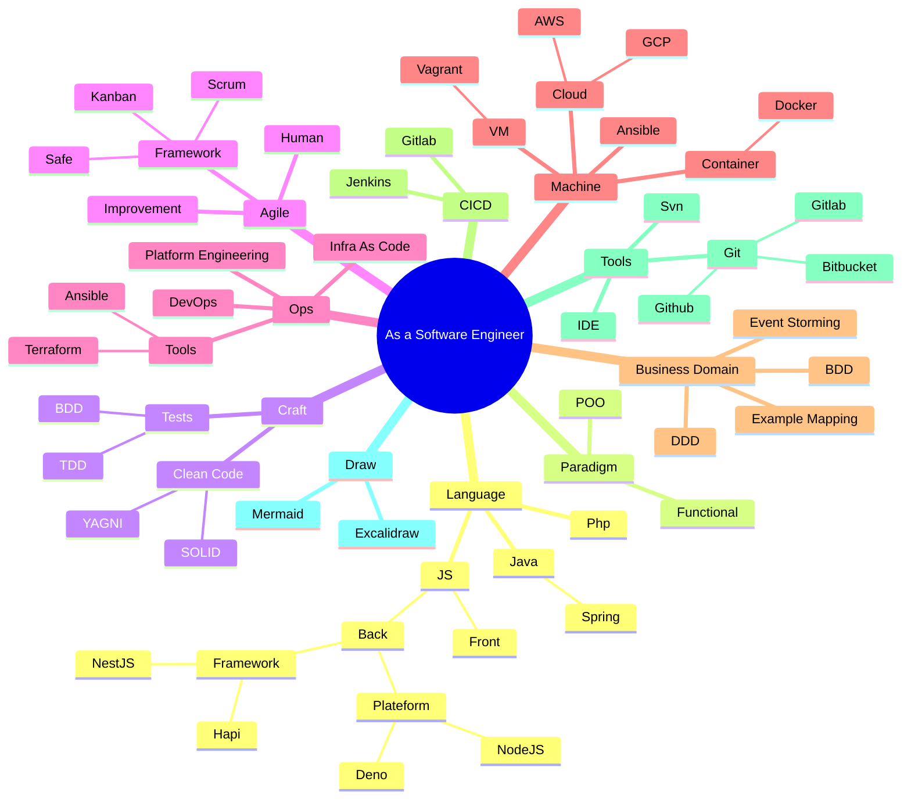

# Computer Science Knowledge

# WORK IN PROGRESS

```mermaid
mindmap
  root((As a Software Engineer))
    Language
      Php
      JS
        Front
        Back
          Plateform
            Deno
            NodeJS
          Framework
            NestJS
            Hapi
      Java
        Spring
        
    Paradigm
      POO
      Functional
    Craft
      Clean Code
        SOLID
        YAGNI
      Tests
        TDD
        BDD
    Agile
      Human
      Improvement
      Framework
        Scrum
        Kanban
        Safe
    Ops
      DevOps
      Infra As Code
      Platform Engineering
      Tools
        Ansible
        Terraform
    Machine
      VM
        Vagrant
      Ansible
      Container
        Docker
      Cloud
        AWS
        GCP
    Business Domain
      DDD
      BDD
      Event Storming
      Example Mapping
    CICD
      Jenkins
      Gitlab
    Tools
      IDE
      Svn
      Git
        Github
        Gitlab
        Bitbucket
    Draw
      Excalidraw
      Mermaid
```
