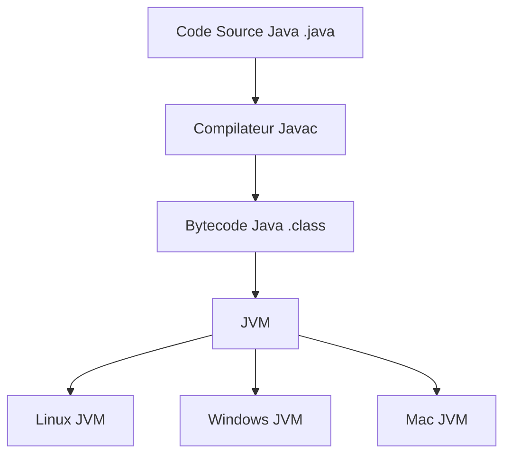

```mermaid
graph TD
    A[Code Source Java .java] --> B[Compilateur Javac]
    B --> C[Bytecode Java .class]
    C --> D[JVM]
    D --> JVM1[Linux JVM]
    D --> JVM2[Windows JVM]
    D --> JVM3[Mac JVM]
```
