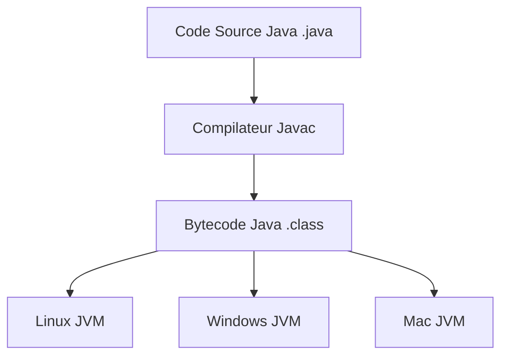
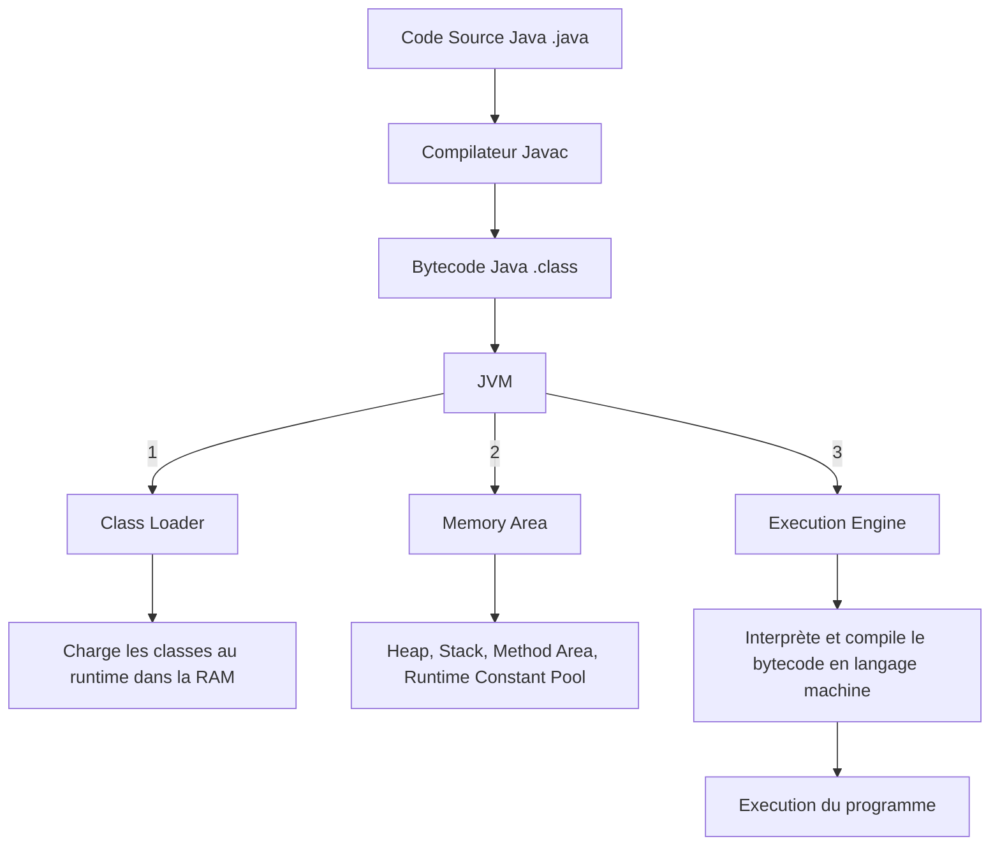

```mermaid
graph TD
    A[Code Source Java .java] --> B[Compilateur Javac]
    B --> C[Bytecode Java .class]
    C --> JVM1[Linux JVM]
    C --> JVM2[Windows JVM]
    C --> JVM3[Mac JVM]
```
Inside 

```mermaid
flowchart TD
    A[Code Source Java .java] --> B[Compilateur Javac]
    B --> C[Bytecode Java .class]
    C --> D[JVM]
    D -->|1| E1[Class Loader]
    D -->|2| E2[Memory Area]
    D -->|3| E3[Execution Engine]
    E1 --> F1[Charge les classes au runtime dans la RAM]
    E2 --> F2[Heap, Stack, Method Area, Runtime Constant Pool]
    E3 --> F3[Interprète et compile le bytecode en langage machine]
    F3 --> G[Execution du programme]
```
