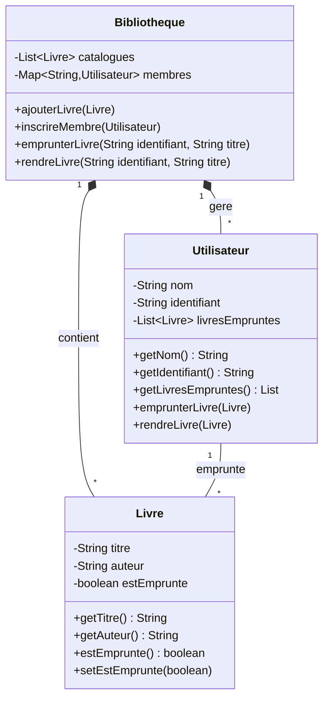

Je vous propose un exercice complet de programmation orientée objet (POO) en Java sur la gestion d'une bibliothèque. Cet exercice couvrira les concepts fondamentaux de la POO tout en créant une application pratique et utile.

### Contexte du Projet

Une bibliothèque municipale souhaite développer un système de gestion informatique pour ses livres et ses emprunts. Le système doit permettre de gérer les livres disponibles et suivre les emprunts des utilisateurs.

### Concepts POO à Mettre en Œuvre

1. Encapsulation :
  - Attributs privés avec accesseurs/mutateurs
  - Masquage des détails d'implémentation


2. Héritage :
  - Création d'une hiérarchie de classes
  - Réutilisation du code


3. Polymorphisme :
  - Redéfinition de méthodes
  - Utilisation d'interfaces


4. Abstraction :
  - Modélisation simplifiée de la réalité
  - Interfaces bien définies


### Structure des Classes

Voici le diagramme de classes qui illustre la structure du système :



Dans ce diagramme UML :

- Les lignes pleines avec losange noir (♦) représentent une relation de composition forte ("contient" et "gere")
- La ligne simple entre Utilisateur et Livre représente une relation d'association ("emprunte")
- Les nombres "1" et "*" indiquent la cardinalité :
  - "1" signifie une instance unique
  - "*" signifie plusieurs instances possibles


### Implémentation des Classes

Voici l'implémentation détaillée de chaque classe :

```java
public class Livre {
    private String titre;
    private String auteur;
    private boolean estEmprunte;
    
    public Livre(String titre, String auteur) {
        this.titre = titre;
        this.auteur = auteur;
        this.estEmprunte = false;
    }
    
    // Accesseurs
    public String getTitre() { return titre; }
    public String getAuteur() { return auteur; }
    public boolean estEmprunte() { return estEmprunte; }
    
    // Mutateurs
    public void setEstEmprunte(boolean estEmprunte) {
        this.estEmprunte = estEmprunte;
    }
}
```

```java
public class Utilisateur {
    private String nom;
    private String identifiant;
    private List<Livre> livresEmpruntes;
    
    public Utilisateur(String nom, String identifiant) {
        this.nom = nom;
        this.identifiant = identifiant;
        this.livresEmpruntes = new ArrayList<>();
    }
    
    // Accesseurs
    public String getNom() { return nom; }
    public String getIdentifiant() { return identifiant; }
    public List<Livre> getLivresEmpruntes() { return livresEmpruntes; }
    
    // Méthodes pour la gestion des emprunts
    public void emprunterLivre(Livre livre) {
        livresEmpruntes.add(livre);
    }
    
    public void rendreLivre(Livre livre) {
        livresEmpruntes.remove(livre);
    }
}
```

```java
import java.util.ArrayList;
import java.util.List;
import java.util.HashMap;
import java.util.Map;

public class Bibliotheque {
    private List<Livre> catalogues;
    private Map<String, Utilisateur> membres;
    
    public Bibliotheque() {
        this.catalogues = new ArrayList<>();
        this.membres = new HashMap<>();
    }
    
    // Gestion des livres
    public void ajouterLivre(Livre livre) {
        catalogues.add(livre);
    }
    
    // Gestion des membres
    public void inscrireMembre(Utilisateur membre) {
        membres.put(membre.getIdentifiant(), membre);
    }
    
    // Gestion des emprunts
    public boolean emprunterLivre(String identifiantMembre, String titreLivre) {
        Utilisateur membre = membres.get(identifiantMembre);
        Livre livre = trouverLivre(titreLivre);
        
        if (membre != null && livre != null && !livre.estEmprunte()) {
            livre.setEstEmprunte(true);
            membre.emprunterLivre(livre);
            return true;
        }
        return false;
    }
    
    public boolean rendreLivre(String identifiantMembre, String titreLivre) {
        Utilisateur membre = membres.get(identifiantMembre);
        Livre livre = trouverLivre(titreLivre);
        
        if (membre != null && livre != null && livre.estEmprunte()) {
            livre.setEstEmprunte(false);
            membre.rendreLivre(livre);
            return true;
        }
        return false;
    }
    
    private Livre trouverLivre(String titre) {
        for (Livre livre : catalogues) {
            if (livre.getTitre().equals(titre)) {
                return livre;
            }
        }
        return null;
    }
}
```

### Exemple d'Utilisation

```java
public class Main {
    public static void main(String[] args) {
        Bibliotheque bibliotheque = new Bibliotheque();
        
        // Ajout de livres
        bibliotheque.ajouterLivre(new Livre("Le Petit Prince", "Antoine de Saint-Exupéry"));
        bibliotheque.ajouterLivre(new Livre("Les Misérables", "Victor Hugo"));
        
        // Inscription d'utilisateurs
        bibliotheque.inscrireMembre(new Utilisateur("Jean Dupont", "JD001"));
        bibliotheque.inscrireMembre(new Utilisateur("Marie Martin", "MM002"));
        
        // Emprunt de livre
        boolean empruntReussi = bibliotheque.emprunterLivre("JD001", "Le Petit Prince");
        System.out.println(empruntReussi ? "Emprunt réussi" : "Emprunt échoué");
        
        // Retour de livre
        boolean retourReussi = bibliotheque.rendreLivre("JD001", "Le Petit Prince");
        System.out.println(retourReussi ? "Retour réussi" : "Retour échoué");
    }
}
```

### Points Clés à Retenir

1. Encapsulation :
  - Les attributs sont privés (`private`)
  - Accès contrôlé via les accesseurs/mutateurs


2. Héritage :
  - Non utilisé directement dans cet exemple
  - Mais la structure permet facilement d'ajouter des classes dérivées


3. Polymorphisme :
  - Utilisation de méthodes redéfinies
  - Interface commune pour les opérations sur les livres


4. Abstraction :
  - Masquage des détails d'implémentation
  - Interfaces simples et cohérentes


### Extensions Possibles

1. Ajouter une date limite pour les emprunts
2. Implémenter un système de réservation
3. Ajouter une catégorie pour les livres
4. Créer un système de recherche avancé
5. Ajouter un historique des emprunts
