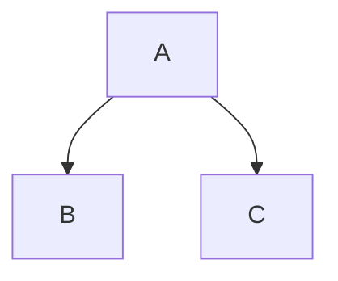

# Tests d'integration

## Definition

## Les 4 types

### Big-Bang Integration

Tous les composants ou modules sont intégrés ensemble en même temps, puis testés comme une unité.

### Top-Down

- A est testé individuellement (B et C stubé)
- A appel B (C est stubé)
- A appel C (B est stubé)
- A appel B et C (aucun stub)

### Bottom-Up

Avantage du Bottom-Up, pas besoin de stub, juste d'un driver qui simule le call du composant parent vers le composant enfant.

### Sandwich Integration / Test d'intégration hybride (Combinaison du Top-Down et Bottom-Up)

## Credits:

https://www.youtube.com/watch?app=desktop&v=m1zk6HSQs6Y

https://www.slideserve.com/kolina/integration-testing

https://www.tutorialspoint.com/software_testing_dictionary/top_down_integration_testing.htm

https://www.softwaretestingmaterial.com/integration-testing/

https://www.guru99.com/fr/integration-testing.html

https://www.guru99.com/fr/how-to-create-test-strategy-document.html
